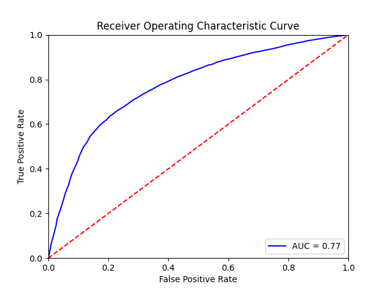

# ML Final Project
## Objective
The objective of this project is to practice my ML skills and apply what I learned.
I will be using real-world data to predict medical conditions like cardiovascular disease and Diabetes type II.
## libraries
```python
import pandas as pd
from sklearn.metrics import roc_curve, auc
from sklearn.model_selection import train_test_split
from sklearn.ensemble import RandomForestClassifier
import matplotlib.pyplot as plt
import seaborn as sns
import pickle
import numpy as np
```
## Datasets
## Structure


## Analysis
### Diabetes


### Cardiovascular 





