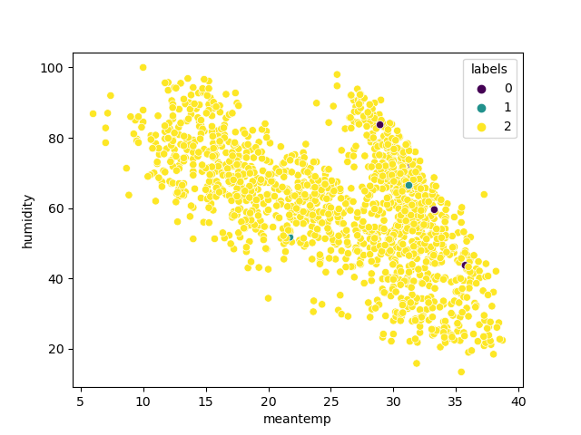

# Unsupervised Learning
## Clustering
### Data Set:

winequality-white.csv
```python
      fixedacidity  volatileacidity  citricacid  residualsugar  chlorides  freesulfurdioxide  totalsulfurdioxide  density    pH  sulphates  alcohol
0              7.4            0.700        0.00            1.9      0.076               11.0                34.0  0.99780  3.51       0.56      9.4
1              7.8            0.880        0.00            2.6      0.098               25.0                67.0  0.99680  3.20       0.68      9.8
2              7.8            0.760        0.04            2.3      0.092               15.0                54.0  0.99700  3.26       0.65      9.8
3             11.2            0.280        0.56            1.9      0.075               17.0                60.0  0.99800  3.16       0.58      9.8
4              7.4            0.700        0.00            1.9      0.076               11.0                34.0  0.99780  3.51       0.56      9.4
...            ...              ...         ...            ...        ...                ...                 ...      ...   ...        ...      ...
1594           6.2            0.600        0.08            2.0      0.090               32.0                44.0  0.99490  3.45       0.58     10.5
1595           5.9            0.550        0.10            2.2      0.062               39.0                51.0  0.99512  3.52       0.76     11.2
1596           6.3            0.510        0.13            2.3      0.076               29.0                40.0  0.99574  3.42       0.75     11.0
1597           5.9            0.645        0.12            2.0      0.075               32.0                44.0  0.99547  3.57       0.71     10.2
1598           6.0            0.310        0.47            3.6      0.067               18.0                42.0  0.99549  3.39       0.66     11.0
```
### Tools:
Python 3.9.13

### Libraries:
```python
import pandas as pd
import numpy as np
import matplotlib.pyplot as plt
import seaborn as sns
from sklearn.cluster import KMeans
from sklearn.preprocessing import StandardScaler
from sklearn.decomposition import PCA
from scipy import stats
```
### Introduction:

The objective of this experiment is to understand K-means clustering model.

### Steps:

1. Importing all the libraries mentioned above.
2. Load the dataset using the pandas library and remove the outliers using the Z-table score for accuracy.
```python
# Load the wine quality dataset
df = pd.read_csv('winequality-white.csv')
 
# Select the features and target
X = df.iloc[:, :10].values
y = df.iloc[:, -1].values
 
# Remove outliers using Z-score
z = np.abs(stats.zscore(X))
X = X[(z < 3).all(axis=1)]
y = y[(z < 3).all(axis=1)]
```
3. When generating the Histograms for each column we can see the difference between the data with outliers and without.
We can therefore continue our operations on the new range of data.

4. The Heatmap generated by the code 

5. Now we are going to check how many clusters we should group our code. Using the elbow diagram, we concluded that we must group the data to 3 clusters.


```python
wcss = []
for i in range(1,11):
    kmeans = KMeans(n_clusters=i, init='k-means++', random_state=0)
    kmeans.fit(X)
    wcss.append(kmeans.inertia_)
plt.plot(range(1,11), wcss)
plt.title('The Elbow Method')
plt.xlabel('Number of Clusters')
plt.ylabel('WCSS')
plt.axvline(x=3, color='red', linestyle="--")
plt.scatter(3, wcss[2],s=100, color="red", marker="o")
plt.show()
```
6. Performed PCA to visualize the data in 2D and started fitting the Kmeans to divide the data to 3 clusters

```python
# Plot the scatter plot of the clusters with each unique color
plt.scatter(X_pca[y_kmeans == 0, 0], X_pca[y_kmeans == 0, 1], s = 100, c = 'red', label = 'Cluster 1')
plt.scatter(X_pca[y_kmeans == 1, 0], X_pca[y_kmeans == 1, 1], s = 100, c = 'blue', label = 'Cluster 2')
plt.scatter(X_pca[y_kmeans == 2, 0], X_pca[y_kmeans == 2, 1], s = 100, c = 'green', label = 'Cluster 3')
plt.title('Clusters of wine quality data')
plt.xlabel('PCA 1')
plt.ylabel('PCA 2')
plt.legend()
plt.show()
```
7. After looking at the cluster diagram, we can see that the white wine has three different wine taste/type depending on all the factors of acidity, sugar and other components.

### Conclusion:

There are three cluster groups in this data set for white wine. The elbow diagram determined that this dataset can be grouped in three groups. The grouping depends on the acidity, sweetness, alcohol level and different other factors.

## Anamoly
### Data Set:

DailyDelhiClimateTrain.csv
```python
         date   meantemp   humidity  wind_speed  meanpressure
0  2013-01-01  10.000000  84.500000    0.000000   1015.666667
1  2013-01-02   7.400000  92.000000    2.980000   1017.800000
2  2013-01-03   7.166667  87.000000    4.633333   1018.666667
3  2013-01-04   8.666667  71.333333    1.233333   1017.166667
4  2013-01-05   6.000000  86.833333    3.700000   1016.500000
```
### Tools:

Python 3.9.13

### Libraries:
```python
import pandas as pd
import numpy as np
import matplotlib.pyplot as plt
import seaborn as sns
from sklearn.ensemble import IsolationForest
from scipy.stats import zscore
```
### Introduction:

The objective of this experiment is to understand anomaly model in Machine Learning.

### Steps:

1. We first import all required libraries.
2. Read the csv file and use pandas to retrieve the data and remove the outliers using the Z-table score.
```python
# Load the dataset
data = pd.read_csv('DailyDelhiClimateTrain.csv')
 
# Remove outliers using the Z-Score method
z_scores = np.abs(zscore(data.drop('date', axis=1)))
data = data[(z_scores < 3).all(axis=1)]
 
# Print a sample table of the data
print(data.head())
```


3. Looking at the Histogram generated by the code, we can see that there are some anomalies.


4. The Gaussian mixture model also show that the data has some anomalies.




5. If we compare the mean temperature and the mean pressure we would get this scatter plot.

We can see that most of the day weather do follow a patter between since there are a solid relationship between temperature and pressure.
As the pressure drops, cold weather migrates to the low pressure zones and thus temperature drops. And as the pressure rises, the temperature rises.

There are a few anomalies in this data and can be caused by false readings or extreme weather conditions like tornados, earthquakes ...
6. The Gaussian distribution plot for anomalies distribution shows that there are anomalies in the temperature around 6-7C and 38-39C

### Conclusion:

The data set of the weather in Delhi had some anomalies that maybe caused by errors in readings or if there is any unusual weather in a specific day.

The relationship between the Mean Temperature and the Mean Pressure is solid and accurate except for some anomalies.

Anomaly detection can be used for many cases to detect extreme weather and predict them in the future.


