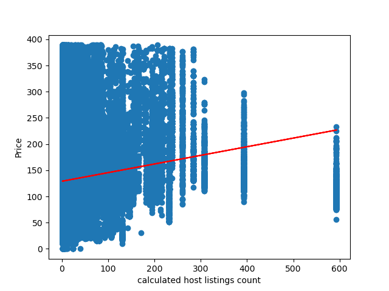
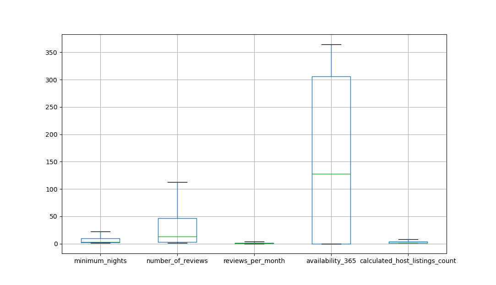

# Supervised Learning
## Regression
In this experiment I used the Airbnb US 2020 data that includes teh following columns:
 

|                     |                   |                                |
|---------------------|-------------------|--------------------------------|
| id                  | latitude          | last_review                    |
| name                | longitude         | reviews_per_month              |
| host_id             | room_type         | calculated_host_listings_count |
| host_name           | price             | availability_365               |
| neighbourhood_group | minimum_nights    | city                           |
| neighbourhood       | number_of_reviews |                                |

 

