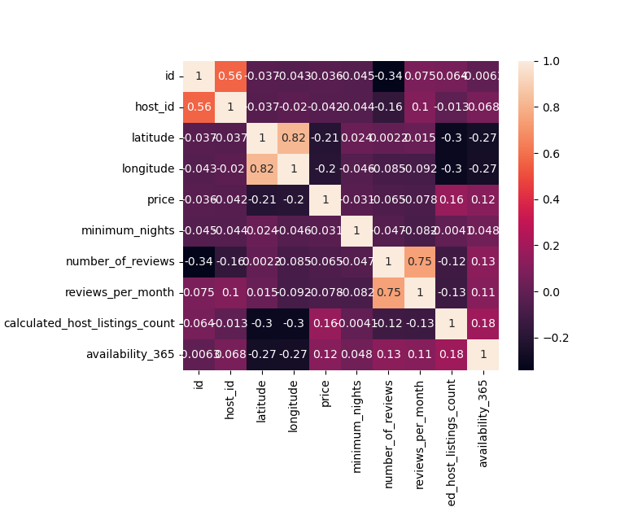
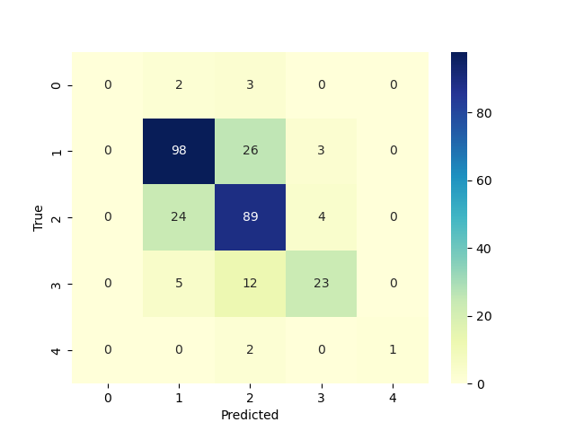
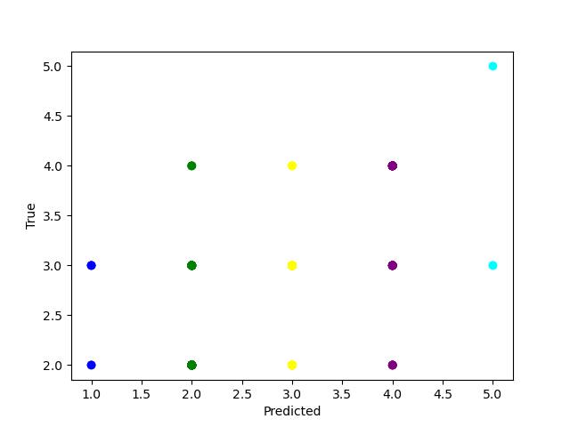
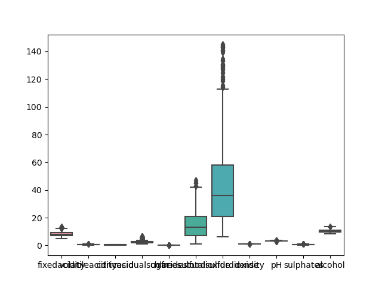
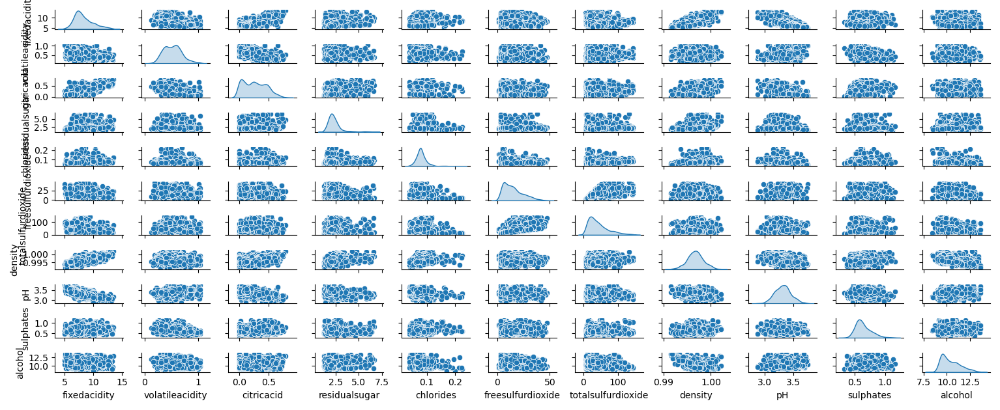

# Supervised Learning
## Regression
In this experiment I used the Airbnb US 2020 data that includes teh following columns:
<br>
**Features:**

|                     |                   |                                |
|---------------------|-------------------|--------------------------------|
| id                  | latitude          | last_review                    |
| name                | longitude         | reviews_per_month              |
| host_id             | room_type         | calculated_host_listings_count |
| host_name           | price             | availability_365               |
| neighbourhood_group | minimum_nights    | city                           |
| neighbourhood       | number_of_reviews |                                |

### Objective
The objective of this experiment is to find the best model that predicts the price of the Airbnb rentals.
<br><br>
### Results
* Boxplot of the cleaned data (free of extreme outliers)


<br>
* Using the heatmap figure below, we can find the correlation between the features and the target variable "price"


* The heatmap figure was able to narrow down the list of features that has the best relation.
```390.0 -114.0
minimum_nights
Intercept: 131.6765634400258
Slope: -6.379826329922614e-07
Relation: -0.0017706040866927672
Function:  -6.379826329922614e-07  * x + 131.6765634400258
------------------------
number_of_reviews
Intercept: 135.59310042488391
Slope: -0.10652519837732573
Relation: -0.08790535144211974
Function:  -0.10652519837732573  * x + 135.59310042488391
------------------------
reviews_per_month
Intercept: 135.44679253112503
Slope: -4.341161726724133
Relation: -0.09518524809037555
Function:  -4.341161726724133  * x + 135.44679253112503
------------------------
availability_365
Intercept: 123.45269065065511
Slope: 0.0525577051315529
Relation: 0.09206215653724747
Function:  0.0525577051315529  * x + 123.45269065065511
------------------------
calculated_host_listings_count
Intercept: 129.00213300445
Slope: 0.16491070972386887
Relation: 0.10642365111416419
Function:  0.16491070972386887  * x + 129.00213300445
------------------------
------------------------
Best relation: calculated_host_listings_count 0.10642365111416419
Intercept: 129.00213300445
Slope: 0.16491070972386887
Relation: 0.10642365111416419
Function:  0.16491070972386887  * x + 129.00213300445
```
* From the previous step we confirmed that the **"Calculated Host Listings Count"** appears as the best feature for the 
**price** variable and with this combination we would get an accurate prediction.
## Classification
In this experiment I used the wine quality dataset that includes the following
columns:
<br>
**Features:**

|                   |                    |
|-------------------|--------------------|
| fixedacidity      | totalsulfurdioxide | 
| volatileacidity   | density            |
| citricacid        | pH                 |
| residualsugar     | sulphates          |
| chlorides         | minimum_nights     |
| freesulfurdioxide | quality            |


### Objective
The objective of this is to generate models for wine quality dataset and find out the best one.
### Results
* I generated a heatmap of the trains and targets and got the following figure


* after splitting the data into trainign and tests and initializing the modele
```python
X = data[["fixedacidity","volatileacidity","citricacid","residualsugar","chlorides","freesulfurdioxide","totalsulfurdioxide","density","pH","sulphates","alcohol"]]
y = data["quality"]

X_train, X_test, y_train, y_test = train_test_split(X, y, test_size=0.2)

clf = RandomForestClassifier()

clf.fit(X_train, y_train)

y_pred = clf.predict(X_test)

accuracy = accuracy_score(y_test, y_pred)
```

```text
Accuracy: 0.7226027397260274
Confusion matrix:
 [[ 0  2  3  0  0]
 [ 0 98 26  3  0]
 [ 0 24 89  4  0]
 [ 0  5 12 23  0]
 [ 0  0  2  0  1]]
```
* Boxplot of the features:


* Scatter Plott




